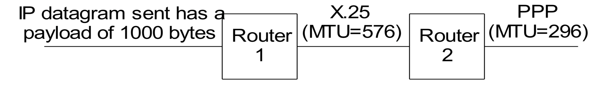
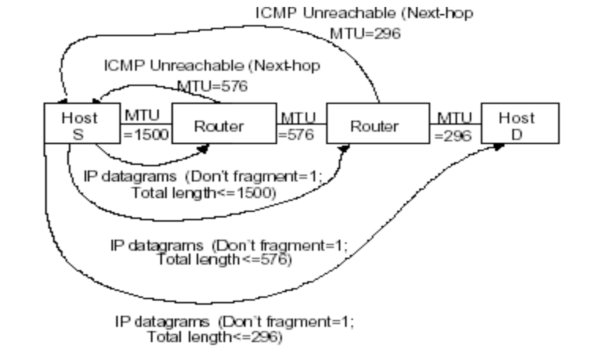

Chapter Five UDP and its Application
====

## The Transport Layer


## UDP VS TCP

|      | UDP                                                          | TCP                                                          |
| ---- | ------------------------------------------------------------ | ------------------------------------------------------------ |
|      | Datagram oriented                                            | Stream oriented                                              |
|      | Unreliable, connectionless                                   | Reliable, connection-oriented                                |
|      | Simple                                                       | Complex                                                      |
|      | Unicast and multicast                                        | Unicast only                                                 |
|      | Commonly used for network control signaling services - Network management (SNMP), routing(RIP), naming (DNS), etc. | Currently used by most Internet applications - Web (HTTP), email (SMTP), file transfer (FTP), terminal (telnet), etc. |
### UDP - User Datagram Protocol

- UDP supports unreliable transmissions of datagrams 
- UDP merely extends the host-to-to-host delivery service of IP datagram to an application-to-application service 
- The only thing that UDP adds is multiplexing and demultiplexing 

### UDP Format

See [UDP Format](Format.md)

### Port Numbers

- UDP (and TCP) use port numbers to identify applications

- A globally unique flow of host application can be identified by a 5-tuple <Src. IP, Dst IP, Src. Port, Dst. Port, Protocol No.> 

- There are 65,535 UDP ports available per host

  - Dynamic/private , used by clients, randomly picked, >49,151 (per IANA)
  - Registered, used by ordinary user processes, 1024 – 49,151
  - Well-known, used by servers, fixed, 1~1023

- Ephemeral Port: short-lived port used as transport protocol port automatically allocated from a predefined range by the TCP/IP stack software:

  - The IANA suggests 49,152 to 65,535 as "dynamic and/or private ports.“ •The BSD uses ports 1,024 through 4,999 as ephemeral ports

  - Many Linux kernels use 32,768 to 61,000 specified in /proc/sys/net/ipv4/ip_local_port_range 

  - MS Windows OS’ through Server 2003 use the range 1,025 to 5,000 as ephemeral ports; use the IANA range since Windows Vista and Server 2008 

  - FreeBSD uses the IANA port range since release 4.6. 

### About Port 0

- Port 0 is a reserved port by IANA 

- Many OS’ allows a source port of 0 from a high layer application for connecting to a remote host. The OS automatically reassigns an ephemeral port when encapsulating the application data to a transport segment 

- No traffic should flow over Internet using port 0 although different OS' have different ways of handling traffic using port 0 

- The external behavior of handling port 0 in different OS's can be “fingerprinted” with a set of tests to send TCP or UDP packet from source port 0 to different destination ports 

- It is highly recommend that one should block any traffic using this port at your firewall so no program should be listening on port 0 and no program should connect from port 0 

## Maximum Transmission Unit (MTU)

- The frame size limit of the data link protocol specifies a limit on the size of the IP datagram that can be encapsulated by the protocol.

- This limit is called Maximum Transmission Unit (MTU)

- MTUs various for different data link protocols:

  Ethernet: 1500

  802.2/802.3: 1492

  802.5: 4464

  FDDI: 4352

  ATM AAL5: 9180

  PPP: 296 (low delay)

- What if the size of an IP datagram exceeds the MTU?

  ```
  IP datagram is fragmented into smaller units.
  ```

- What if the route contains networks with different MTUs?

  ```
  The smallest MTU of any data link is used as the Path MTU.
  ```

## IP Fragmentation

- Host A sends a large IP datagram to Host B.
- How does the intermediate router handle this?
  - IP router splits the datagram into several fragments.
  - Fragmentation requires that the data portion of every fragment except the last be a multiple of 8-bytes.


### Where is Fragmentation done?

- Fragmentation can be done at the sender and at intermediate routers.
- The same datagram can be fragmented several times.
- Reassembly of original datagram is only done at destination hosts.


### What’s involved in Fragmentation?


- **Identification** is the same in all fragments.
- **Flags** field contains
  - a reserved bit, must be zero
  - a Don’t Fragment (DF) bit that can be set, and
  - a More Fragments (MF) bit.
- **Fragment Offset** contains the offset (in 8-byte units) of current fragment in the original datagram.
- **Total Length** is changed to be the size of the fragment.

### Fragmentation through Multiple Links



- The ID field stays the same for all fragments of a datagram sent by a sender to allow for reassemble
- The fragment offset is relative to the datagram sent by the sender. 
- Two fragments created on X.25 link (offsets 0, 69) 

  - 576 – 20 (IP header) = 556; 552 divides by 8 as 69. 
  - First fragment: Offset 0, bytes 1~552; second fragment: Offset 69, bytes 553~1000 
- Each fragment is fragmented further on the PPP link
  - ID stays the same on all fragments 
  - Fragment offset on the second set of fragments is relative to the original (0, 34, 68, 69, 103) > 296-20=276; 272/8 = 34

### If the Don’t Fragment flag is set...

- If fragmentation is needed, and the Don’t Fragment flag is set, The router drops the datagram and sends an ICMP unreachable error message to the source. 
- This can be used in Path MTU Discovery to find the smallest MTU along a path. 

- The format of an ICMP unreachable error message(See [icmp_unreachable_error_message](Format.md): 

   

## Path MTU Discovery

- A host sends a set of IP datagrams with various lengths and the “don’t fragment” bit set



