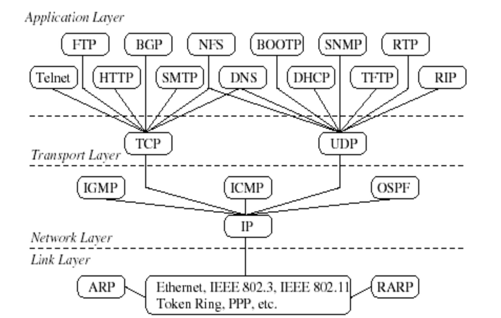
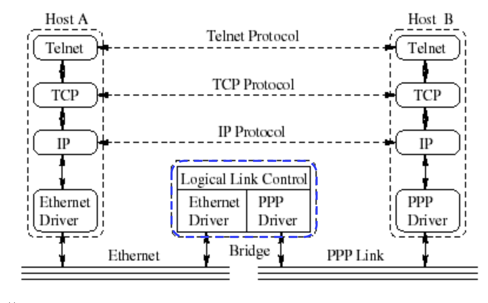
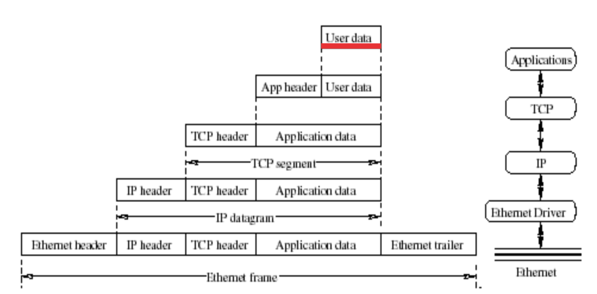
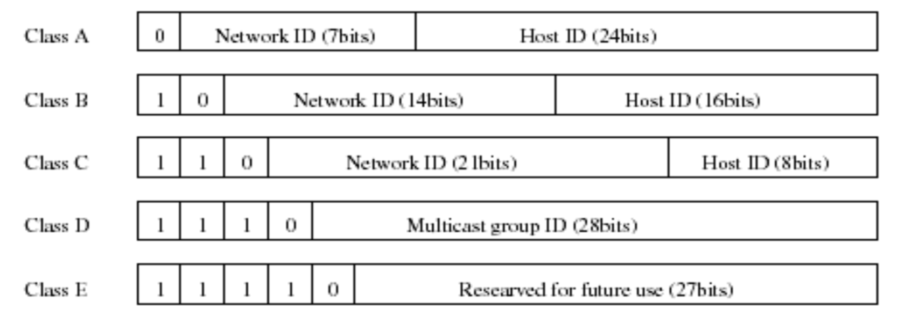

IAPIntro
====

- All information from class IAP and related PPT slides tought by Zhongping Jiang

## Chapter One 

### Internet Standard Control

- ISOC

- IAB

- IETF

- IRF

### TCP/IP Protocols

- Internet Protocol Suite
- A combination of different protocols 
- Organized into four layers
  - Application Layer
  - Transport Layer
  - Network Layer
  - Data Link Layer

### Functions of the Layers

- Application Layer: HTTP, telnet, DNS, SNMP, DHCP
- Transport Layer: UDP, TCP
- Network Layer: IP, ICMP, IGMP
- Data Link Layer: Ethernet, Wi-Fi, PPP, ARP, etc

### Protocols in Different Layers



### Internetworking Devices

- Classified according to their functionality andlayers

  - Hub

  ```
  
  ```

  - Bridge

  ```
  Discuss: What's the difference between Bridge and Switch
  ```

  - Switch
  ```
  
  ```
  - Router
  ```
  
  ```
  - Gateway
  ```
  
  ```

### Hosts Communicating over a bridge




### Hosts Communicating over a router


### Encapsulation


```
TCP: segment
IP: datagram
Ethernet: frame
```

### Multiplexing and Demultiplexing

#### pros

```

```

#### cons

````

````

### Naming and Addressing

- Uniquely identify processes in different computers for communications.

  - Domain name

    ```
    
    ```

  - MAC address

    ```
    
    ```

    - Question: Since IP:Port can identify a process, why MAC address is necessary?

  - IP address

    ```
    
    ```

  - Port number

    ```
    
    ```

### Multiple Access

- Explaination

  ```
  
  ```

### Ethernet Frame Format

See ([EthernetFrame](Format.md) )

### IP Address

#### IPv4

#### IPv6

### Five Classes of IP Addresses

- The end points of each range are not allowed because all zeros and all ones are disallowed for Network ID and Host ID (see later discussion).




- Problems
- Solutions: [Subnetting](#subnetting)

### Subnetting

- goals

```
  
```
- Basic Idea
```

```
- Subnets can be freely assigned and be used for many physical networks. 
- Distant routers need not be aware of subnet id’s. 

- Cons:

```
  
```

### RFC1812 on Special IP Address

| Network ID   | Host ID      | Special Address                  |
| ------------ | ------------ | -------------------------------- |
| Specific     | All 0’s      | Network address                  |
| Specific     | All 1’s (-1) | Direct broadcast address         |
| All 0’s      | Specific     | Specified host on this network   |
| All 0’s      | All 0’s      | This host on this network        |
| All 1’s (-1) | All 1’s (-1) | Limited broadcast address in LAN |
| 127          | Any          | Loopback address                 |

- DISCUSSION: 

```
Previous versions of this document also noted that subnet numbers must be neither 0 nor -1, and must be at least two bits in length. With Classless InterDomain Routing (CIDR), the subnet number is clearly an extension of the network prefix and cannot be interpreted without the remainder of the prefix. This restriction of subnet numbers is therefore meaningless in view of CIDR and may be safely ignored.
```

### IPv4 Packet Format

See [IPv4 Package Format](Format.md)

### Port Number (per RFC 4340)

### UDP Header Format

See [UDP Header Format](Format.md)

