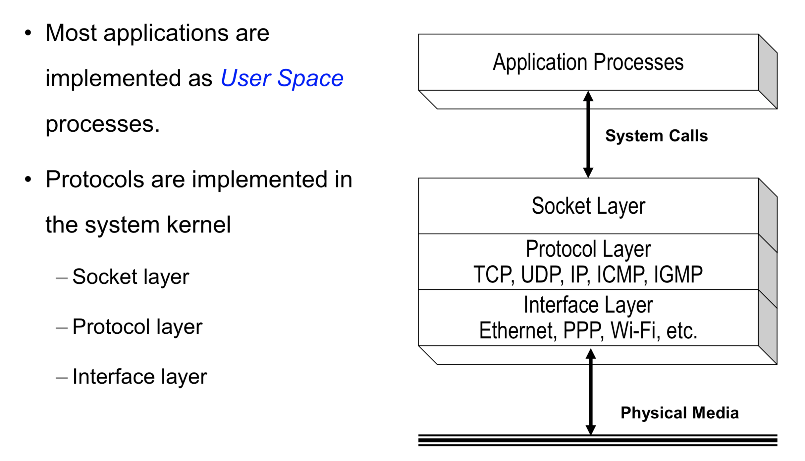

Chapter One Linux and TCP/IP Networking
====

### Linux and TCP/IP Implementations

- Networking Code Organization

  

### Network Daemons and Services
#### Daemons
- inetd

```
  
```
- httpd
```

```
- named
```

```
#### Port Numbers

- There are 65,535 UDP ports available per host

  - Dynamic/private , used by clients, randomly picked, >49,151(0xbfff) (per IANA)
  - Registered, used by ordinary user processes, 1024 (0x400) – 49,151
  -  Well-known, used by servers, fixed, 1~1023

### Network Configurations Files

- When a host is configured to boot locally, TCP/IP configuration parameters are stored in files.
  - /etc/services (well-known port numbers, a.k.a. System Port numbers)
  - /etc/inetd.conf (inetd daemon parameters)
  - /etc/sysconfig/network (host name, default gateway IP address)
  - /etc/resolv.conf (IP addresses of DNS servers)
- When the system boots up, parameters are read from the files and used to configure the daemons and the network interface.
- A parameter may be changed by editing the corresponding configuration file.
- Most user hosts today are configured remotely by DHCP server (dynamic host configuration protocol) with distributed network configuration parameters


