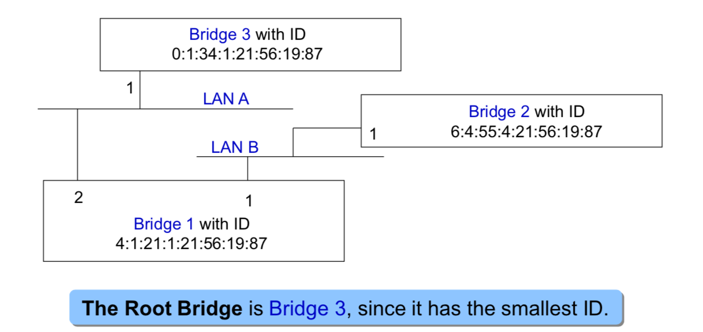

Chapter 3 Bridges, LANs, and the Cisco IOS
====

## Bridges

- Interconnect multiple LANs, possibly of different types 
- Bridges operate at the Data Link Layer (Layer 2) 
- Pass frames to a different LAN if the destination is not on the local LAN. 


### Why & What Bridges

- Bridges allow to build a local area network with multiple small LANs instead of one single LAN, which increases 
  - reliability
  - throughput
  - security
  - coverage span 

- **Transparent bridges** are not seen by hosts if they connect same type of LANs. 
  
  - Most frames are simply copied to the respective destination network <= not necessarily flooding to all networks/segments 
  - No change in the header and data section. 
  
- **Source Route bridges**, another form of bridging, use a field in frame header, ex. the Routing Information Field (RIF) in token ring header, to indicate the series of bridges along the routing path

  **DISCUSS**: What is RIF?

  ```
  
  ```
### Bridge Function – an Example

- Those to Host 2 ... Host 10 are forwarded on LAN A 

- Those to Host 11 ... Host 20 are forwarded on LAN A, accepted and repeated further 

  on LAN B 

  

### **Filtering Database of a Bridge** 

- MAC addresses of the hosts are stored in a Filtering Database in the bridge. 
- Elements of each entry of the filtering database 
  - The destination MAC address 
  - The bridge port where frames for this destination MAC address should be forwarded to
  - The age of this entry 
- The filtering database could be set statically 
- In an IEEE 802.1d bridge, the filtering database is maintained automatically by a **MAC Address Learning** process. 

### **Address Learning Process** 

- When a frame is received, its source MAC address and the incoming port are updated in the bridge’s filtering database. 
- The default age of a new entry is 300 sec. 


### **Address Learning** **–** **an Example** 

- **Address Learning** **–** **an Example** 

  **<Src=A, Dest=F>, <Src=C, Dest=A>, <Src=E, Dest=C> **

- What have the bridges learned?

  

  

### **Bridge Operations** 

-  A bridge makes forwarding decisions by filtering database lookups. 
  - If an entry is found, the bridge forwards the frame to the network segment indicated by the entry. 
  -  Otherwise, **Flooding** is used. The frame is copied to all active ports except the incoming port. 

### **Danger of Loops** 

-  Address learning and forwarding scheme may cause serious problems when there is a loop. 
- Assume:
  - Host 1 sends a frame to Host X (not shown in the picture below).
  - There is no entry about Host X in Bridge 1 and Bridge 2’s filtering database. 

-  Bridges 1 and 2 both
   - receive the frame on LAN B, and learn that host 1 is on LAN B,
   - correctly add the entry for Host 1 in their filtering database, and
   - Forward the frame to LAN A using flooding since there is no entry for Host X. 
   


- Then, each bridge 

  - will receive the same frame forwarded by the other bridge, and 
  - will incorrectly change the filtering database entry to indicate that Host 1 is on LAN A 
-  This process will repeat indefinitely, which leads to a *broadcast storm*. 
- Other traffic can be blocked, resulting in a network meltdown. 


### **Removing Loops** 

- The solution to the loop problem is to remove loops. 

- IEEE 802.1 has an algorithm, Spanning Tree Protocol (STP), that builds and maintains a Spanning Tree in a dynamic environment. 

- Bridges exchange messages, **Configuration Bridge Protocol Data** Units (Configuration **BPDUs**), to configure the bridge and build the tree. 

### A Graph of a Network

- A bridged network can be viewed as a graph 

  - The bridges are nodes
  - The LAN segments are edges 

  

### **A Tree of a Network**

- A tree is a graph with no loops 
- Disable some bridge ports to remove loops 
  - port 2 of Bridge 3 in the figure 
- In a tree, there is only a single path between any two hosts 


### **Building a Spanning Tree** 

#### 1. **Bridge ID**  

- Each bridge has a unique identifier (8 bytes) defined: 
  - Bridge ID = <bridge Priority Level + MAC address> 
  - Priority Level has 2 bytes that can be configured 
  - A bridge has several MAC addresses (one for each port), but the Bridge ID uses only the MAC address of the lowest numbered bridge port (port 1) 
- Each port within a bridge has a unique identifier (port ID). 


#### 2. **Root Bridge of a Network** 

- A spanning tree can be “built” from its logical root – a Root Bridge 
- **Root Bridge**: The bridge with the lowest identifier is the root of the spanning tree. 



**DISCUSS** Can a port be designated port and root port?

```

```

#### 3. **For Each Bridge** 

- **Root Port**: Each bridge has a root port which identifies the next hop from a bridge to the root. 
- **Root Path Cost**: the cost of the min-cost path to the root. 
- For **Bridge 1**: 
  - The root port is port 2 since it leads to the Root Bridge (Bridge 3) 
  - The root path cost is 1 since bridge 1 is one hop away from the Root Bridge (i.e., Bridge 3). 
- **Note**: We assume that “cost” of a path is the number of “hops”. This “cost” can take the value per IEEE 802.1D based on the port speed or be set to different values when designing the network. 


#### 4. **For Each LAN** 

- **Designated Bridge**: single bridge on a LAN that provides the minimal cost path to the root for this LAN 
- **Designated Port**: the port on this minimal cost path. 
- If two bridges have the same cost, select the one with highest priority (lower bridge ID) 
- If the min-cost bridge has two or more ports on the LAN, select the port with the lowest identifier 

#### 5. **For Each LAN Segment** 

- For LAN A, the designated bridge is Bridge 3 since it is the Root Bridge itself; the designated port is port 1. 
- For LAN B, the designated bridge is Bridge 1 since this is closer to the root bridge than bridge 2. The designated port is port 1. 

#### 6. **Designated Bridge and Designated Port** 

- Even though each LAN is the entity that has a designated bridge/designated port, it is each bridge that determines whether or not it is the designated bridge for the LAN on each of its ports, because a LAN is a group of hosts, there is no centralized control over a LAN. 
- Example: Bridge 1 in the example on [](3. For Each Bridge) determines whether it is the designated bridge for LAN A (to which its port 2 is connected) and for LAN B (to which its port 1 is connected). 

### **Spanning Tree Algorithm** 

- **Step 1:** Each bridge is assigned a unique identifier, and each port of a bridge is assigned an identifier unique to the bridge. 
- **Step 2:** Determine the root bridge of the whole network. 
- **Step 3:** For all other bridges determine root ports. 
- **Step 4:** For all bridges, determine which of their bridge ports are respective designated ports for the corresponding LANs. 
- **Step 5:** Only the root ports and designated ports of bridges are allowed to forward frames. 
  - These ports are all set to the “forwarding state,” while all other ports are in a “blocked state.” 
  - The spanning tree consists of all the root ports and the designated ports. 
- **Step 6:** Repeat steps 1 to 5 whenever the network topology changes. 

### **Determine the Spanning Tree** 

- Bridges determines the spanning tree in a “distributed manner” by using exchanged BPDUs. 
  - Elect a single bridge as the root bridge. 
  - Each bridge can determine: 
    - a root port, the port that gives the best path to the root bridge. 
    - and the corresponding root path cost 
- Each bridge determines whether it is a **designated bridge**, for the LANs connected to each of its ports. The designated bridge will forward packets the corresponding LANs towards the root bridge. 

- Select ports to be included in the spanning tree. 
  - Root ports and designated ports 
- It takes some time for a network to converge. 

### Configuration BPDUs


Note – 

- Shown format above used for building single spanning tree 
- New format introduced to support Multiple Spanning Tree Protocol (MSTP) for Virtual LANs (VLANs) 

####  **Short Form Notation for BPDUs** 

- Each bridge sends out BPDUs
  - With Bridge Group Address starting like 01:80:C2:00:00:00 
  - Containing the following information: 


#### **Ordering of BPDU Messages** 


### **Determine the Root Bridge** 

- Initially, each bridge assumes itself is the root bridge. 

- Each bridge B sends BPDUs of this form on its LANs: **B_0_B/p**

  ​	note p changes its value as the sending port ID 

- Each bridge looks at the BPDUs received on all its ports and its own transmitted BPDUs. 

- **Root Bridge** is the smallest received root ID that has been received so far (Whenever a smaller ID arrives, the root is updated). 

### **Calculate the Root Path Cost Determine the Root Port** 

- At this time: Bridge B has a belief of who the root is, say R. 

Bridge B determines the Root Path Cost (Cost) as follows: 

```
If B = R:  Cost = 0.
If B != R: Cost = {Smallest Cost in any of BPDUs that were
received from R} + 1 (hop, as the additional cost)
```

- **B’s root port** is the port from which B received the lowest cost path to R 
- Knowing R and Cost, B/p can generate its BPDU (but will not necessarily send it out): **R_cost_B/P**

### **Determine if the bridge is the designated bridge for any of the LANs connected to its ports** 

- B has generated its BPDU. B will send this BPDU on one of its ports, say port x, only if its BPDU is lower than any BPDU that B received from port x. Then the BPDU sent from port x is **R_cost_B/x**
- In this case, B also assumes that it is the **designated bridge** for the LAN to which port x connects. 

**DISCUSS** Wat?????

### **Select Ports for the Spanning Tree** 

- Bridge B has calculated the root bridge for the network, its root port, root path cost, and whether it is the designated bridge for each of its LANs. 
- Now B can decide which ports are in the spanning tree:
  - B’s root port is part of the spanning tree
  - All ports for which B is the designated bridge are part of the spanning tree. 

- B’s ports that are in the spanning tree will forward packets (**forwarding state**)
-  B’s ports that are not in the spanning tree will block packets (**blocking state**) except BPDUs and other needed control protocol frames  

### **Adapt to Changes** 

- Bridges continually exchange BPDU’s according to the rules we just discussed. 
- This allows the bridges to adapt to changes to the topology. 
- Whenever a BPDU arrives on a port, say port x, bridge B determines: 
  - Can B become the designated bridge for the LAN that port x is attached to? 
  - Can port x become the root port?


### **Building the Spanning Tree** 


### **802.1Q Virtual LANs (VLAN)** 

- IEEE 802.1Q defines the operation of VLAN Bridges to partition a LAN 

  - Hosts are assigned to logical groups (VLANs) to communicate within each group in Layer2 
  - Each bridge port is configured to support one or more VLANs 
  - Bridges filter destination addresses and forward VLAN frames only to ports that serve the VLAN to which the traffic belongs 

- Applications

  - Enterprise customers to segregate traffic for different communities of interest, ex. financing, engineering, customer service, ... 
  - Broadcast control to avoid traffic flooding to entire L2 network 
  - Service providers to isolate different customers’ traffic from each other 

  

### **IEEE 802.1Q/p VLAN and Priority Tagging** 


- **Maximum frame size w/ VLAN tag becomes 1518 + 4 = 1522 bytes** 
- TPID (Tag Protocol IDentifier) sets to 81:00 for Ethernet, other protocols includeToken Ring, FDDI, ... 802.1ad assigns TPID 88:a8 for Ethernet in S-VLAN tag
- 3 bits Priority Code Point (PCP) for p0 to p7 eight priority levels
- CFI (Canonical Format Indicator) sets if this is a Token Ring frame encapsulated in an Ethernet format; see 802.ad slides for DEI definition
- 12 bits VLAN IDentifier (VID) supports 4096 unique VLAN tags

### **Configure a Bridge or Router** 

- All network devices require initial configuration and ongoing management carried by higher layer functions (in network system software) for configuration and management tasks. 
- Cisco Internet Operating System (IOS) is the one used by widely deployed Cisco made network equipment. 

#### **Cisco IOS** 

- Cisco IOS provides different ways to configure and maintain a Cisco device. 

- Delivers network services such as Operations, Administration, and Maintenance (OAM) of the network platforms and Internet applications. 
- Supports a broad range of platforms and many networking protocol families. 
- Enables network applications on the network platforms. 

#### **Cisco IOS Configuration Modes** 


## Wireless LANs

### IEEE 802.11 Wireless LANs

Alternative to the wired Ethernet: 

- Wireless channel 

- Frequency band: unlicensed radio spectrums 

Protocols: 
- IEEE 802.11b: 5, 11Mbps channel speed, 2.4GHz frequency band 
- IEEE 802.11a: 6, 9, 12, 18, 24, 36, 48, 54Mbps, 5GHz frequency band 
- IEEE 802.11g: 54 Mbps, 2.4GHz band 
- IEEE 802.11i: security 
- IEEE 802.11f: Inter Access Point Protocol 
- IEEE 802.11e: Quality of Service enhancement, ..., video optimized 
- IEEE 802.11n: data rate great than 100 Mbps using MIMO, 2.4G and/or 5GHz bands 
- IEEE 802.11ac: single stream up to 433 Mbps, more spatial streams, 5GHz band 
- IEEE 802.11ax: MIMO, MU-MIMO, and OFDMA aimed for close to 10 Gbps 

Range: Transmission power up to 100mW 
- Indoor: 20 - 25 meters 
- Outdoor: 50 - 100 meters 

### **IEEE 802.11 Architecture** 

- Made with one basic service set (BSS) 
- The ad hoc mode, a.k.a. independent BSS 
  - No connection to wireline network
  - Hosts communicate with each other directly. 


### **802.11: Channels, association** 

802.11b example: 2.4GHz – 2.485GHz spectrum divided into 11 channels at different frequencies 

- AP admin chooses frequency for AP 

  ─ Interference possible: channel can be same as that chosen by neighboring AP! 

- Host must associate with an AP 

  - ─  Scans channels, listening for beacon frames containing AP’s name (SSID) and MAC address (BSSID) 
  - ─  Selects AP to associate with 
  - ─  May need to perform authentication 
  - ─  Run DHCP to get IP address in AP’s subnet 

#### **IEEE 802.11 Frame Format** 

SEE [**IEEE 802.11 Frame Format** ](Format.md)

#### **802.11 MAC Addresses** 

MAC header contains up to 4 MAC addresses: 

- MAC addresses are globally unique IDs assigned by manufacturer to any network interface card (NIC). 

Addresses:

- RA, TA = receiving, transmitting MAC addresses

- BSSID = ID of BSS of the transmission, AP MAC or a desiganated ID (ad hoc) 

- DA, SA = end-to-end destination, source MAC address (wired or wireless) 

  – May be different from RA, TA in multi-hop wireless transmission, rarely used. 


#### **802.11 frame: addressing** 


#### **IEEE 802.11: multiple access** 

- Collisions: 2+ nodes transmitting at same time 
- 802.11: CSMA - sense before transmitting 
  - don’t collide with ongoing transmission by other node 

- 802.11: *no* collision detection (CD)! 
  - difficult to receive (sense collisions) when transmitting due to weak received signals (fading) 
  - can’t sense all collisions in any case: hidden terminal, fading 
  - goal: *avoid collisions**:* CSMA/C(ollision)A(voidance) 


#### CSMA/CA

- CSMA: carrier sensing
   – Carrier: don’t send
   – No carrier: send
   – Needs to be enhanced in wireless networks 

- CA: collision avoidance – random backoff
   – priority ack protocol 

- Media Access Control coordination function:
   – Distributed Coordination Function (DCF) for multiple access – Point Coordination Function (PCF) for polling-based priority – Hybrid Coordination Function (HCF) per 802.11e 

- Practically, CSMA/CA is CSMA with explicit ACK frame 

### **IEEE 802.11 MAC Layer Priority** 

- MAC layer priority is defined through different Inter Frame Spaces 
  - DIFS(DCF IFS)
     – Lowest priority, for asynchronous data service 

- PIFS (PCF IFS)
  - – Medium priority, for time-bounded service using PCF 
- SIFS (Short Inter Frame Spacing)
  - – Highest priority, for ACK, Clear To Send (CTS), Polling response 

