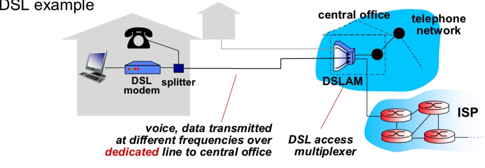
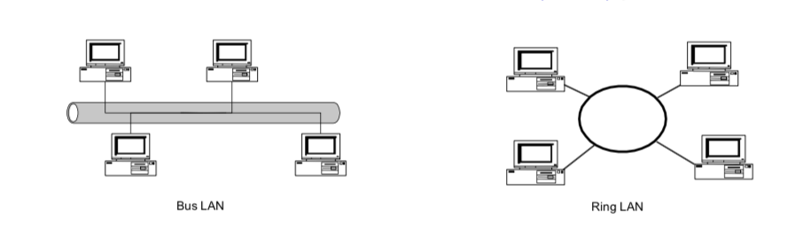
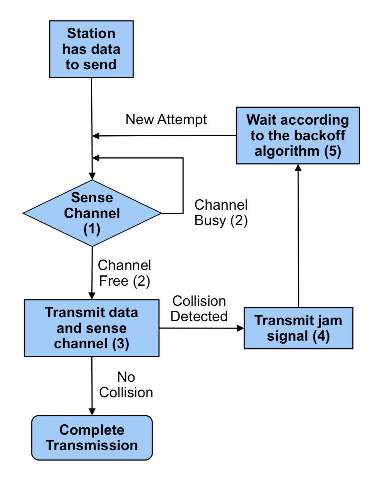
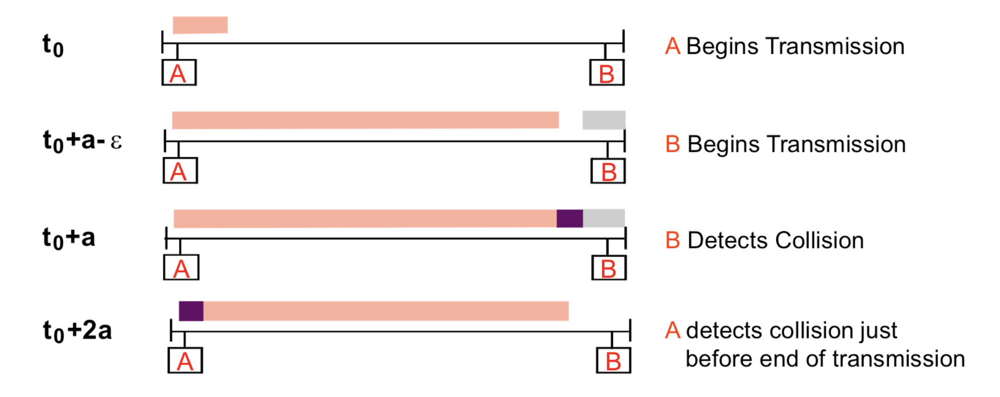
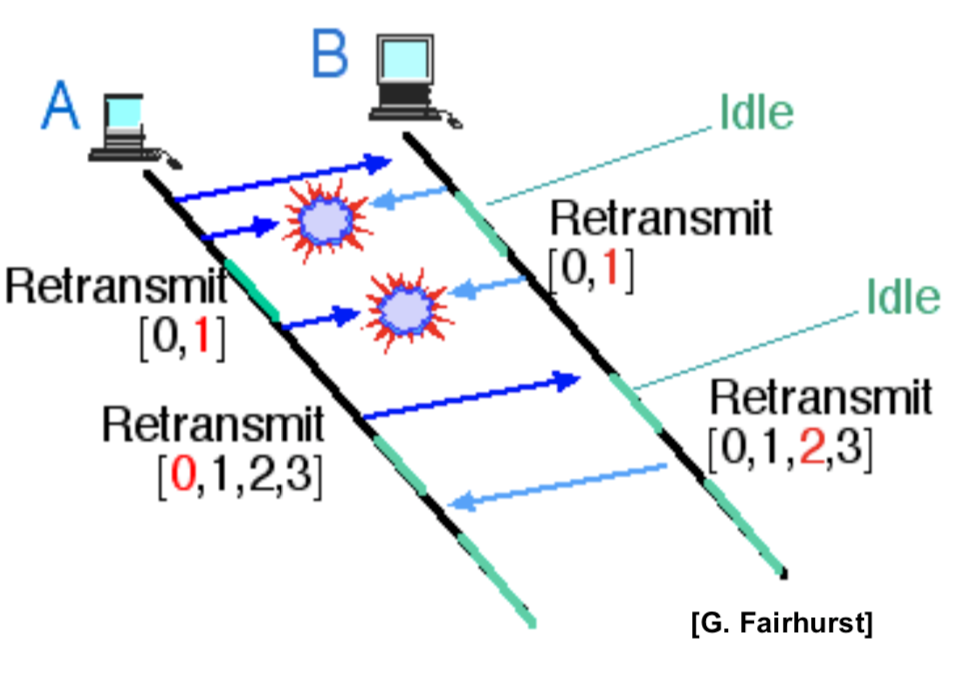
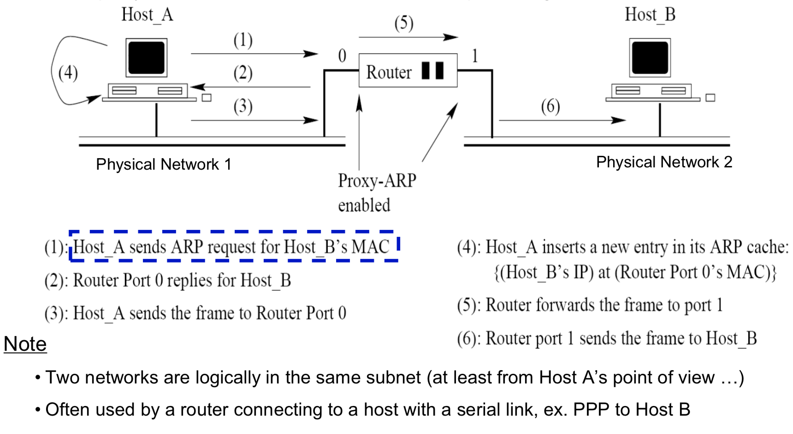
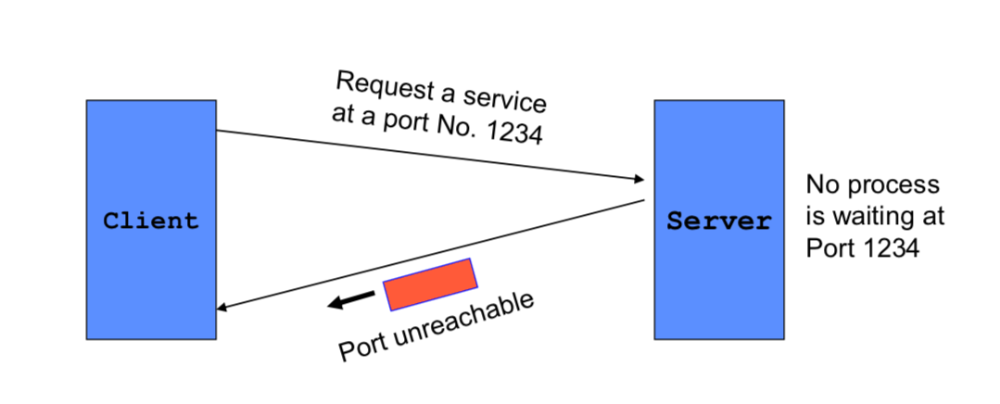
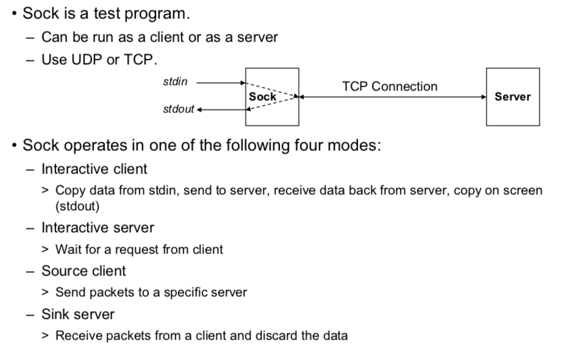

Chapter 2 A Single Segment Network – Data Link Layer
====

## Data Link Layer

#### Main tasks

- Transfer network layer data from one machine to another machine via “a data link”.
- Convert the data between raw bit stream of the physical layer and groups of bits →bytes → frames.
- Perform flow control between sender and receiver.

## Types of Networks

#### Point-to-point network

- Each link connects two end points: hosts or any network devices/elements 
- Usually for long distance connections 
- Examples: DSL (digital Subscriber Loop), POS (Packet over SONET/SDH), GbE (Gigabit Ethernet)

#### Broadcast network

- A number of stations share a common transmission medium 
- Usually for local networks 
- Examples: CSMA/CD Ethernet, WLAN (Wireless Local Area Network), a.k.a. Wi-Fi 

## Point-to-Point Protocol

- The Point-to-Point Protocol (PPP) is a data link protocol 

- The main purpose of PPP is encapsulation and transmission of IP datagrams, or other network layer protocol data, over a serial link. 

- Currently, PPP is used by most dial-up Internet access, Digital Subscriber Loop (DSL), and cable broadband services. 

  

### Point-to-Point Protocol (RFC 1661)

PPP consists of two types of control protocols:

- Link Control Protocol (LCP)

  1. Responsible for agreeing on PPP encapsulation options, packet size limits, and  detecting common mis-configuration errors over the data link

  2. Optional features to provide peer authentication, detect link status

- Network Control Protocol (NCP)

  1. **PPP supports a family of NCPs and treat each network protocol like an interface**

  2. **IP Control Protocol (IPCP, RFC 1332), used for configure the link to transmit IP datagrams**

     ```
     discuss: wat???
     ```

## PPP Encapsulation

See [PPP Encapsulation](format.md)

## Local Area Networks

- Local Area Networks (LANs) typically connect computers within a building or a campus. 
- Many LANs are broadcast networks. 
- Bus and Ring are two typical LAN topologies used in early days 
- The protocol that determines who can transmit on a broadcast channel is called Medium Access Control (MAC) protocol. 



## MAC and LLC

- In any broadcast network, the stations must ensure that only one station transmits at a time on the shared communication channel. **(MAC Layer's responsibility)**
- The protocol that determines who can transmit on a broadcast channel is called Medium Access Control (MAC) protocol. 
- The MAC protocol is implemented in the MAC sublayer which is the lower sublayer of the data link layer. 
- The higher portion of the data link layer is often called Logical Link Control (LLC). 

### MAC

- **Discuss: MAC Layer's responsibility is to control the order of concurrent data to shared medium. **
- MAC algorithm: 
  - ALOHA
  - [CSMA/CD](#csmacd)
  - CSMA/CA

#### CSMA/CD



```
1.Each station listens before it transmits.
2.If the channel is busy, it waits until the channel goes idle, and then it transmits.
3.If the channel is idle it transmits immediately and continue sensing for 2a seconds.
4.If collision is detected, transmit a brief jamming signal then cease transmission.
5. Wait for a random time, and retransmit. The random time is determined by exponential backoff algorithm.

a is assumed to be the maximum propagation delay on the network
```


**DISCUSS**: pros and cons

```

```

#### Collisions in Ethernet

- The collision resolution process of Ethernet requires that a collision is detected while a station is still transmitting.
- Restrictions: Each frame should be at least twice as long as the time to detect a collision (2a).



**DISCUSS**: In what way the host sniffing the collision? Is it because host A get data while it is sending data to the shared medium? If it is half duplex, will the data received be messed up?

```

```

#### Exponential Backoff Algorithm

- If a station is involved in a collision, it waits a random amount of time before attempting a retransmission.
- The random time is determined by the following algorithm:
  - Set “slot time” to 2a. 
  - After first collision wait 0 or 1 time unit. 
  - After the ith collision, wait a random number between 0 and 2i-1 time slots. 
  - Do not increase random number range if i>9. 
  - Give up after 16 collisions. 
```python
MAX_TRY = 16
MAX_WAIT = 9
def sendData(data):
    slotTime = 2 * a; # a means the max propagation delay
    waitTime = 0
    while not detectCollision() and waitTime < MAX_TRY:
        waitTime = min(MAX_WAIT, waitTime+1)
        wait(random.randint(2**(waitTime - 1)) * a)
    return False if waitTime == MAX_TRY else True
```



### LLC

- LLC can provide different services to the network layer:
  - “unacknowledged” connectionless service
  - acknowledged connectionless service
  - connection-oriented service

## Ethernet Switches

In an Ethernet LAN, hosts can be 

- Attached to a common cable, or 
- Connected by Ethernet switches. 

Ethernet switches are MAC layer devices that switch frames between ports connected to different LAN segments.

- Offer guaranteed bandwidth for segments. 
- Separate a LAN into collision domains. 

## Ethernet Encapsulation 

#### RFC 894

See [Ethernet Encapsulation](format.md)

#### IEEE 802.2/802.3

See [Ethernet Encapsulation](format.md)

### Address Resolution Protocol
- How to get HW address for data transfer?

  ```
  ARP table: each IP node (host, router) on LAN has table
  - IP/MAC address mappings for some LAN nodes: <IP address; MAC address; TTL>
  - TTL (Time To Live): time after which address mapping will be forgotten (typically 20 min)
  ```

- IP addresses are not recognizable in the interface layer where physical addresses (or MAC addresses) are used. 
- Different kinds of physical networks use different addressing schemes. 
- Address Resolution Protocol (ARP): maps an IP address to a MAC address per RFC 826.
- Reverse Address Resolution Protocol (RARP): maps a MAC address to an IP address per RFC 903.

#### ARP Process

- When a source host (or a router) wants to send an IP packet to a the MAC address corresponding to destination , it first broadcasts an ARP request asking for a target IP address 

  - The broadcasting is performed over host’s network interface (or one of the interfaces specified by router’s routing table)
  - The target is the device to receive this IP packet
- A target device will return an ARP reply with its MAC address.

#### ARP Packet Format

See [ARP Packet Format](format.md)

#### ARP Cache

- Sending an ARP request/reply for each IP datagram is inefficient.
- Each host maintains an ARP cache containing the recent resolved IP addresses.
- A source host first checks its ARP cache for the destination MAC address
  - If an entry is found, sends out the IP packet within an Ethernet frame.
  - Otherwise, sends out an ARP request

#### Manipulating the ARP Table
- Elements of an entry in the ARP table:
  - An IP address
  - A MAC address
  - Flags
- A normal entry expires after 20 minutes after it is created or the last time it is referred.
- Manipulate ARP table by the arp command:
  - arp –a: Displays all entries in the ARP table.
  - arp –d: Deletes an entry in the ARP table.
  - arp –s: Inserts an entry into the ARP table.

#### Proxy ARP (RFC 1027)

- Hide the two physical networks from each other.
- Use a proxy-ARP-enabled router to answer ARP requests targeted for a host ...



#### Gratuitous ARP

- Occurs when a host sends an ARP request (or reply) that is not normally needed since the sender’s and the target IP addresses are identical 

- Usually happens when the interface is configured at bootstrap time. 

- The interface uses gratuitous ARP request to determine if there are other hosts using the same IP address. 

- The sender’s IP and MAC address are broadcast, and other hosts will insert this mapping into their ARP tables. 

  **DISCUSS: ** [rarp usage](https://www.practicalnetworking.net/series/arp/gratuitous-arp/)

  ```
  1. Updating ARP Mapping
  2. Announcing a Node’s Existence
  3. Redundancy
  ```
#### Loopback Interface

- Most TCP implementations have a loopback interface with IP address 127.0.0.1 and named as localhost. 
- The localhost behaves as a separate data link interface. 
- A packet that is sent to the loopback interface moves down the protocol stack and is returned back by the driver software for the localhost “device”. 
- Used for debugging. 
- Packets sent to loopback interface will not appear on network. 

## Maximum Transmission Unit

- There is a limit on the data packet size of each data link layer protocol.
- This limit is called Maximum Transmission Unit (MTU).
- MTUs for various data link layers:
  - Ethernet, PPP: 1500 bytes
  - FDDI: 4352 bytes
  - PPP (low delay): 296 bytes
- **MTU does not count its own header and trailer bytes of the data link protocol**. e.g. Ethernet’s MTU is 1500 bytes.

## Internet Control Message Protocol

- The Internet Control Message Protocol (ICMP) is the protocol used for error and control messages in Internet.
- ICMP provides an error reporting mechanism of routers to the sources.
- All ICMP packets are encapsulated as IP datagrams (IP protocol type 1)
- The packet format is simple. Packet format: See [icmp packet format](Format.md)

### ICMP Message Types

- ICMP messages are either query messages or error messages. 

- ICMP query messages: 

  – Echo request / Echo reply

   – Router advertisement / Router solicitation

  **DISCUSS**: More Detail

   – Timestamp request / Timestamp reply

   – Address mask request / Address mask reply 

- ICMP error messages: 

  – Host unreachable

  – Source quench

  – Time exceeded 

  – Parameter problem 

### ICMP Error Message

- Each ICMP error message contains the header and at least the first 8 bytes of the IP datagram **payload** that triggered the error message. 

  **DISCUSS**: Why does ICMP contain 8 bytes of the IP datagram payload

```

```

- To prevent that too many ICMP messages, ICMP error messages are NOT sent 
  - for multiple fragments of the same IP datagrams 
  -  in response to an error message

  - in response to a broadcast packet 

#### ICMP Port Unreachable

- If, in the destination host, the IP module cannot deliver the datagram because the indicated protocol module or process port is not active, the destination host may send a port unreachable message to the source host. 



#### Format

See [ICMP Port Unreachable](sources/Frame.md)

#### **Packet InterNet Gopher (PING)** 

- PING is a program that utilizes the ICMP echo request and echo reply messages. 
- PING is used to verify if a certain host is up and running. It is used extensively for fault isolation in IP networks. 
- PING can be used with a wide variety of options, e.g. 
  - *-R* (Record route): includes the RECORD_ROUTE option in the ECHO_REQUEST packet and displays the route buffer on returned packets. 
  - *-s packetsize*: specifies the number of data bytes to be sent (default is 56) (in newer implementations, -s is used to continuously generate queries) 

#### Echo Request and Reply

- Ping’s are handled directly by the kernel. 

- Each Ping is translated into an ICMP Echo Request. 

- The Ping’ed host responds with an ICMP Echo Reply. 


- Message format

  - Identifier is set to process ID of querying process.
  - Sequence number is incremented for each new echo request. 

  See [Echo Request and Reply](sources/Format.md)

### Sock Traffic Generator

