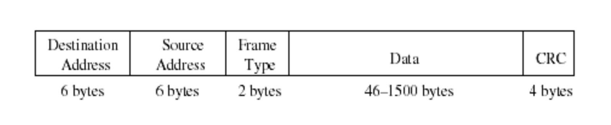
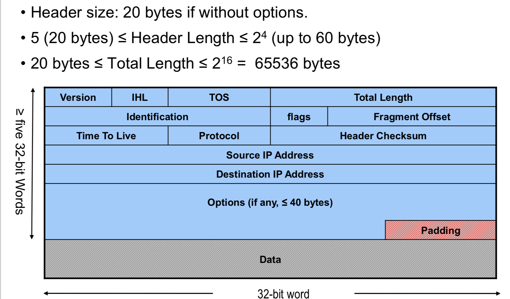
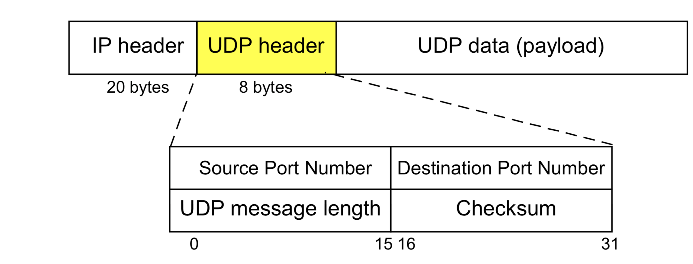
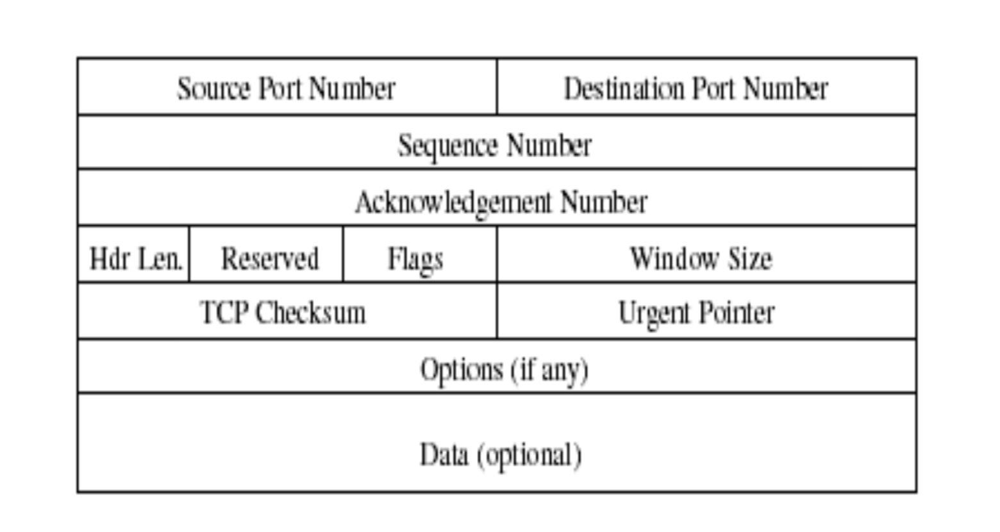

Format
====

### Ethernet Frame Format



- Source Ethernet (MAC) Address
- Destination Ethernet Address
- Frame Type: used to identify the payload
- CRC: used for error control

### IPv4 Package Format



- Version: current version is 4, new version is 6.

- IHL (Internet Header Length, 4 bits): Number of 32-bit words in the IP  header 

- Type of Service (TOS): contains 4 TOS bits, where each bit indicates a desired service.

  - Only one bit can be set! Not supported in all applications.

- Total Length: Number of bytes in the IP datagram (header+payload)

- Identification: unique identification of a datagram from a host. Incremented whenever a datagram is transmitted.

- Flags and Fragrment Offset: Associated with fragmentation

- Time To Live (TTL): specifies longest path before datagram is dropped.

  - Used to prevent infinite looping of packets

    ```
    Discuss: Who can drop the packets? Host? Router?
    ```

  - TTL field is set at sending host and is decremented by 1 at each router

  - If a router gets a datagram whose TTL is either 0 or 1, the router will drop the packet.

  - If a destination host gets a datagram whose TTL is larger than 0, the host will deliver **the** datagram to the higher layer.

- Protocol: Specifies the higher-layer protocol. Used for demultiplexing to higher layers.

  | Higher Layer Protocol | value |
  | --------------------- | ----- |
  | TCP                   | 6     |
  | ICMP                  | 1     |
  | UDP                   | 17    |
  | IGMP (???)            | 2     |

- Header Checksum: verifies correctness of header.

- Source and Destination Addresses: identify the interfaces on the sending and receiving hosts

- Options:

  - Security: indicates security and handling restrictions, ... 
  - Record Route: each router that processes the packet adds its IP address to the header. 
  - Timestamp: each router that processes the packet adds its IP address and time to the header. 
  - (loose) Source Routing: specifies a list of routers that must be traversed. 
  - (strict) Source Routing: specifies a list of the only routers that can be traversed. 

- Padding: ensures that header ends on a 4-byte boundary 

### UDP Header Format



### TCP Packet Format

