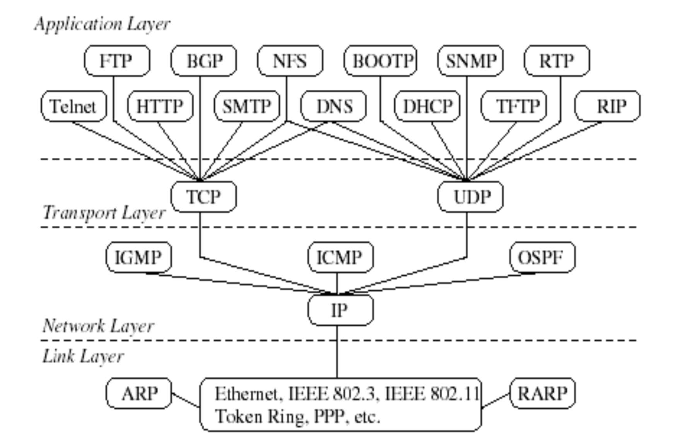
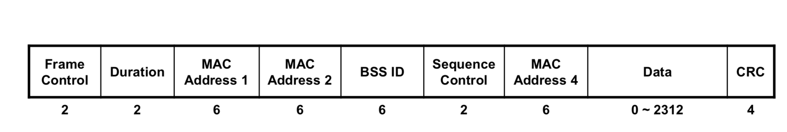
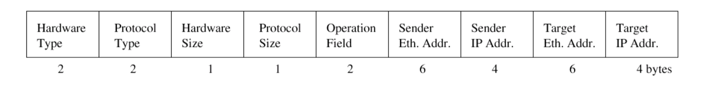
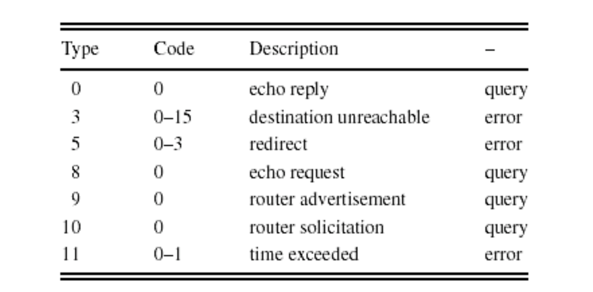
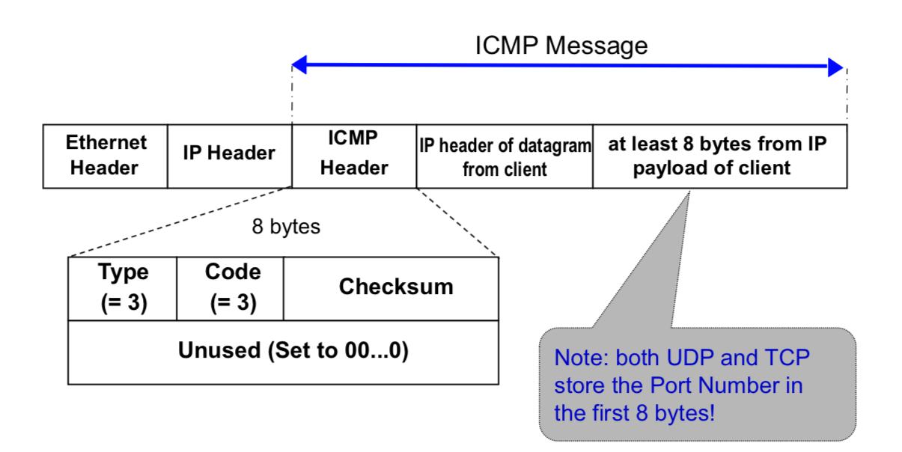
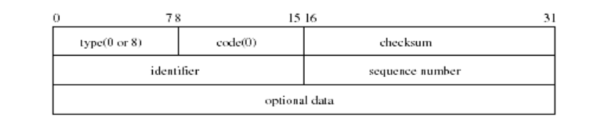

#Format
====



## Link Layer

### Ethernet Frame Format


- Source Ethernet (MAC) Address
- Destination Ethernet Address
- Frame Type: used to identify the payload
- CRC: used for error control

#### Ethernet Encapsulation (RFC 894)


-  Dest. Addr., Src. Addr.: MAC addresses are 48 bit

- Type: Identifies the content of the data field **(must ≥ Ox0600)**
- CRC: Cyclic Redundancy Check

#### IEEE 802.2/802.3 Encapsulation


- Destination address, Source address: MAC addresses are 48 bit (displayed as 12 hexadecimal characters)
- Length: frame length in number of bytes **(<Ox0600, 1,500 bytes → Ox05dc)**
- DSAP, SSAP: always set to 0xaa
- Ctrl: set t o 3
- Org code: set to 0
- Type field: identifies the content of the data field
- CRC: cyclic redundancy check
- Total frame size: 64 bytes to 1518 bytes
  Overhead: 38 bytes including 12 bytes Inter Frame Gap (IFG)

**DISCUSS** How to distinguish IEEE 802.2/802.3 and RFC 894?

```
By the length and type field field（No.13 byte, No.14 byte）. 802.2/802.3 < 0x600, RFC 894 >= 600. 
```

### **IEEE 802.11 Frame Format** 



- More fields than other data-link protocols 
- High overhead: 
  - 30 byte header 
  - Four Address fields: BSSID, Source Address (SA), Destination Address (DA), Receiving Station Address (RA), Transmitting station Address (TA) depend on Frame Control setting 

- Different frame types for different tasks: – Some fields are not presented in all types of frames 

## IPv4 Package Format


- Version: current version is 4, new version is 6.

- IHL (Internet Header Length, 4 bits): Number of 32-bit words in the IP  header 

- Type of Service (TOS): contains 4 TOS bits, where each bit indicates a desired service.

  - Only one bit can be set! Not supported in all applications.

- Total Length: Number of bytes in the IP datagram (header+payload)

- Identification: unique identification of a datagram from a host. Incremented whenever a datagram is transmitted.

- Flags and Fragrment Offset: Associated with fragmentation

- Time To Live (TTL): specifies longest path before datagram is dropped.

  - Used to prevent infinite looping of packets

    **Discuss: Who can drop the packets? Host? Router?**

  - TTL field is set at sending host and is decremented by 1 at each router

  - If a router gets a datagram whose TTL is either 0 or 1, the router will drop the packet.

  - If a destination host gets a datagram whose TTL is larger than 0, the host will deliver **the** datagram to the higher layer.

- Protocol: Specifies the higher-layer protocol. Used for demultiplexing to higher layers.

  | Higher Layer Protocol | value |
  | --------------------- | ----- |
  | TCP                   | 6     |
  | ICMP                  | 1     |
  | UDP                   | 17    |
  | IGMP (???)            | 2     |

- Header Checksum: verifies correctness of header.

- Source and Destination Addresses: identify the interfaces on the sending and receiving hosts

- Options:

  - Security: indicates security and handling restrictions, ... 
  - Record Route: each router that processes the packet adds its IP address to the header. 
  - Timestamp: each router that processes the packet adds its IP address and time to the header. 
  - (loose) Source Routing: specifies a list of routers that must be traversed. 
  - (strict) Source Routing: specifies a list of the only routers that can be traversed. 

- Padding: ensures that header ends on a 4-byte boundary 


## UDP Header Format


- **Port Numbers** identify sending and receiving applications (processes). The maximum value for a port number is 216-1= 65,535 
- **Message Length** is between 8 bytes (i.e., data field can be empty) and 65,535 bytes (length of UDP header and data in bytes) 
- **Checksum** is for UDP header and UDP data 

### UDP checksum

- Optional: 
1. set all 0’s if not calculated
2. A calculated checksum can never be all 0’s.
- Computed using the UDP header, UDP data and a pseudo-header as below.
- All fields of pseudo-header are available in UDP layer

## TCP Packet Format


## PPP Encapsulation

- PPP frame format
  - Flag: mark the beginning and ending of a frame
  - Protocol: used to multiplex different protocol data
  - No addressing, only two end hosts.


## ARP Packet Format



- 28 bytes long.

- An ARP request or ARP reply is encapsulated in an Ethernet frame.

  – The protocol type in Ethernet frame is set to 0x0806 for ARP messages.

- Hardware Type - Specifies a hardware interface type for which the sender requires a response, i.e. Ethernet (1) in our case

  **DISCUSS:** What's the usage of Hardware Type?

- Protocol type - Specifies the type of high-level protocol address the sender has supplied, ie. IP (Ox0800) in our case

  **DISCUSS:** What's the usage of Protocol Type?

- Hlen - Hardware address length.

- Plen - Protocol address length.

- Operation field specifies ARP request (1), ARP reply (2), RARP request (3), or RARP reply (4).


## ICMP

### Format


### Types



### ICMP Unreachable Error


### ICMP Port Unreachable



### Echo Request and Reply

